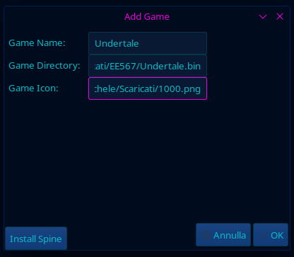
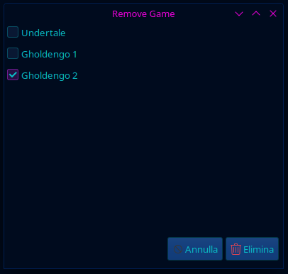

# SpineGTK
   [](https://creativecommons.org/licenses/by-nc/4.0/)

SpineGTK is a Cross-Platform GUI Launcher for Spine made with GTKSharp and Mono.

## Platforms
|Platform|Status    |
|--------|----------|
|Linux   |Working   |
|Windows |Working   |
|MacOS   |Not Tested|

## Installation
- ### Docker
    - First of all you need to install Docker:
        - On Debian-Based Distros:
            - [See How](https://docs.docker.com/desktop/install/debian/)
        - On Ubuntu-Based Distros:
            - [See How](https://docs.docker.com/desktop/install/ubuntu/)
        - On RedHat-Based Distros:
            - [See How](https://docs.docker.com/desktop/install/fedora/)
        - On Arch-Based Distros:
            - [See How](https://docs.docker.com/desktop/install/archlinux/)
        - On Windows:
            - [See How](https://docs.docker.com/desktop/install/windows-install/)
        - On MacOS:
            - [See How](https://docs.docker.com/desktop/install/mac-install/)
     - Pull the Release from Docker Hub:
        ```
        docker pull pokemichele/spinegtk:v1
        ```
     - Add Permissions to accept Local Connections to the Display:
        ```
        xhost + local:
        ```
        If it doesn't work at the first try you may have to use 'export DISPLAY=:0' to set the primary display as an environment variable
        NOTE: On Windows and MacOS you may have to install an XServer Software like VcXsrv, Xming (For Windows) or XQuartz (For MacOS) and get the WSL/XServer IP Address using 'ipconfig'
     - Run it with the following Command:
        ```
        docker run --network=host --env DISPLAY=$DISPLAY -v /tmp/.X11-unix:/tmp/.X11-unix -it pokemichele/spinegtk:v1
        ```
        or [On Windows]
        ```
        docker run --network=host --env DISPLAY=x.x.x.x:0.0 -it pokemichele/spinegtk:v1
        ```
        (Replace x.x.x.x with your WSL/XServer IP Address)
        NOTE: You can change some parameters based on your host machine
        
        NOTE: You may have to pass Game Files through Docker to see them inside the FileSystem
- ### Mono [Obsolete]
    - First of all you need to install Mono (6.12.0.182+) and NuGet (2.12+):
        - On Debian-Based Distros:
            ```
            sudo apt-get install mono-complete nuget
            ```
        - On SUSE-Based Distros:
            ```
            sudo zypper in mono-complete nuget
            ```
        - On RedHat-Based Distros:
            ```
            sudo yum install mono-complete nuget
            ```
             or
            ```
            sudo dnf install mono-devel nuget
            ```
        - On Arch-Based Distros:
            ```
            sudo pacman -S mono
            sudo yay -S nuget
            ```
    - Make sure you have all the permissions needed to run the file
        ```
        cd /your/directory/
        ```
        ```
        chmod +x SpineGTK_v1.exe
        ```
    - Install the dependencies (only if it's necessary)
        ```
        nuget install Mono.GtkSharp -NoCache -OutputDirectory .
        nuget install GioSharp -NoCache -OutputDirectory .
        nuget install System.IO.Compression -NoCache -OutputDirectory .
        nuget install System.Xml.Linq -NoCache -OutputDirectory .
        ```
        If you still have problems try to install all the dependencies listed in the Dockerfile (chage apt with your default package manager if it's necessary)
        
    - Execute the Software with all its dependencies (some dll names may change base on the download source):
        ```
        mono SpineGTK_v1.exe -r:atk-sharp.dll -r:gdk-sharp.dll -r:gio-sharp.dll -r:glade-sharp.dll -r:glib-sharp.dll -r:gtk-sharp.dll -r:Mono.Posix.dll -r:pango-sharp.dll -r:System.dll -r:System.IO.Compression.dll -r:System.IO.Compression.FileSystem.dll -r:System.Net.dll -r:System.Xml.dll -r:System.Xml.Linq.dll
        ```
        or
        ```
        mono SpineGTK_v1.exe
        ```
        If you prefer you can create a shell script.
## Behaviour
- Adding a Game:
    - Click "Add Game" button
    - If you are running the software for the first time click the "Install Spine" button and wait until the software unlocks itself (it may take a while depending on your connection speed).
    - Insert a Name for the Game, the Path of the file (you must use a file format that is compatible with Spine), and an Icon that will appear in the Launcher (optional).

    

    - Click the Ok/Enter Button
    - Click the new game's button to run it
- Removing a Game:
    - Click on "Remove Game" button
    - Select the games you want to remove from the list
    
    

    - Click on Remove/Delete Button
## Building from Source
- The simplest way to build this project is installing MonoDevelop and make it compile the project by itself:
    - Install MonoDevelop (See the official [Installation Instructions](https://www.monodevelop.com/download/))
    - Open the project
    - Compile it (with the button)
- Another way to build it is copying and pasting all the commands listed in the Dockerfile, in order to run the software locally (chage apt with your default package manager if it's necessary)
## FAQ
- Why C#?
    - I wanted to practice with C# and I think it's one of the best Object-Oriented Languages to use for this project.
- Why Mono and GTKSharp?
    - I used Mono and GTKSharp because they are simpler to learn than other Cross-Platform Frameworks, like [Avalonia](https://avaloniaui.net/) + You can run the software with all your beautiful GTK Themes.
- Why Docker?
    - I used docker to build and distribute this project because it was simpler for building GTKSharp Applications with their dependencies than other solutions like [Flatpak](https://flatpak.org/) or [AppImage](https://appimage.org/).
- Is SpineGTK related to the original Spine Project?
    - No, SpineGTK is an indipendent project made by PokeMichele.
- Is SpineGTK legal?
    - Yes, because the only goal of this software is to wrap the original emulator with a GUI.
## Troubleshooting
- If you run into some problems before opening an issue make sure it's not a Spine problem. If so, check that the error hasn't already been reported in [Their Repository](https://github.com/devofspine/spine)
## Credits & License
 - SpineGTK is made using [Mono](https://www.mono-project.com/), [GTKSharp](https://www.mono-project.com/docs/gui/gtksharp/), [Amr.ImageResizer](https://amr-design.net/NuGet/) and [Docker](https://www.docker.com/), wraps [Spine](https://github.com/devofspine/spine/) with a GUI and it's released under [CC BY-NC 4.0 License](https://creativecommons.org/licenses/by-nc/4.0/).
