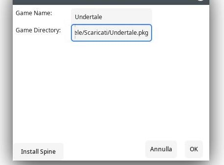

# SpineGTK
  [](https://creativecommons.org/licenses/by-nc/4.0/)

SpineGTK is a simple GUI Launcher for Spine made with GTKSharp and Mono.

## Platforms
|Platform|Status                                               |
|--------|-----------------------------------------------------|
|Linux   |Working                                              |
|Windows |Some Functions may work, but you don't need to run it|
|MacOS   |Not Working                                          |

## Installation
- ### Mono
    - First of all you need to install Mono (6.12.0.182+) and NuGet (2.12+):
        - On Debian-Based Distros:
            ```
            sudo apt-get install mono-complete nuget
            ```
        - On SUSE-Based Distros
            ```
            sudo zypper in mono-complete nuget
            ```
        - On RedHat-Based Distros:
            ```
            sudo yum install mono-complete nuget
            ```
             or
            ```
            sudo dnf install mono-devel nuget
            ```
        - On Arch-Based Distros
            ```
            sudo pacman -S mono
            sudo yay -S nuget
            ```
    - Make sure you have all the permissions needed to run the file
        ```
        cd /your/directory/
        ```
        ```
        chmod +x SpineGTK_v1.exe
        ```
    - Install the dependencies (only if it's necessary)
        ```
        nuget install AtkSharp -NoCache -OutputDirectory .
        nuget install GdkSharp -NoCache -OutputDirectory .
        nuget install GioSharp -NoCache -OutputDirectory .
        nuget install GLibSharp -NoCache -OutputDirectory .
        nuget install GtkSharp -NoCache -OutputDirectory .
        nuget install Mono.Posix -NoCache -OutputDirectory .            #For Older Mono Versions
        nuget install System.Native.Posix -NoCache -OutputDirectory .   #For Newer Mono Versions
        nuget install PangoSharp -NoCache -OutputDirectory .
        nuget install System.IO.Compression -NoCache -OutputDirectory .
        nuget install System.Xml.Linq -NoCache -OutputDirectory .
        ```
    - Execute the Software with all its dependencies:
        ```
        mono SpineGTK_v1.exe -r:adk-sharp.dll -r:gdk-sharp.dll -r:gio-sharp.dll -r:glade-sharp.dll -r:glib-sharp.dll -r:gtk-sharp.dll -r:Mono.Posix.dll -r:pango-sharp.dll -r:System.dll -r:System.IO.Compression.dll -r:System.IO.Compression.FileSystem.dll -r:System.Net.dll -r:System.Xml.dll -r:System.Xml.Linq.dll
        ```
        If you prefer you can create a shell script.
## Behaviour
- Click "Add Game" button
- If you are running the software for the first time click the "Install Spine" button and wait until the software unlocks itself (it may take a while depending on your connection speed).
- Insert a Name for the Game and the Path of the file (you must use a file format that is compatible with Spine).



- Click the Ok/Enter Button
- If you don't see the game you've just added try to reload the Software.
- Click the new game's button to run it
## Building from Source
- The simplest way to build this project is installing MonoDevelop and make it compile the project by itself:
    - Install MonoDevelop (See the official [Installation Instructions](https://www.monodevelop.com/download/))
    - Open the project
    - Compile it (with the button)
## FAQ
- Why C#?
    - I wanted to practice with C# and I think it's one of the best Object-Oriented Languages to use for this project.
- Why Mono and GTKSharp?
    - I used Mono and GTKSharp because they are simpler to learn than other Cross-Platform Frameworks, like [Avalonia](https://avaloniaui.net/) + You can run the software with all your beautiful GTK Themes.
- Is SpineGTK related to the original Spine Project?
    - No, SpineGTK is an indipendent project made by PokeMichele.
- Is SpineGTK legal?
    - Yes, because the only goal of this software is to wrap the original emulator with a GUI.
## Troubleshooting
- If you run into some problems before opening an issue make sure it's not a Spine problem. If so, check that the error hasn't already been reported in [Their Repository](https://github.com/devofspine/spine)
## Credits & License
 - SpineGTK is made using [Mono](https://www.mono-project.com/) and [GTKSharp](https://www.mono-project.com/docs/gui/gtksharp/), wraps [Spine](https://github.com/devofspine/spine/) with a GUI and it's released under [CC BY-NC 4.0 License](https://creativecommons.org/licenses/by-nc/4.0/).
